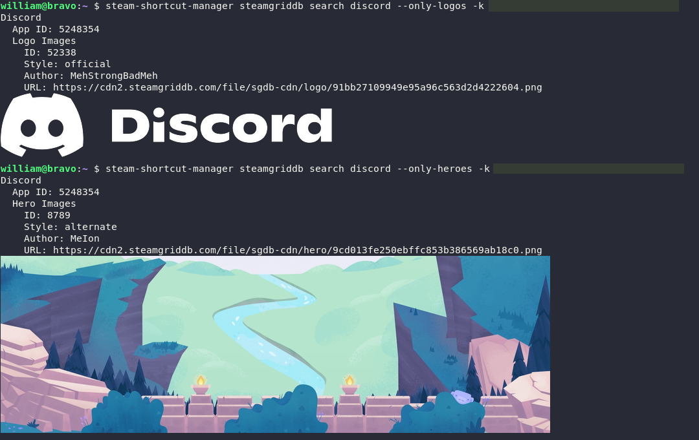

# steam-shortcut-manager

Steam Shortcut Manager is a command-line utility written in Go that you can use
to manage your Steam library shortcuts.

# Features

- Command-line interface for managing your shortcuts. Allows you to automate shortcut creation in scripts and other programs.
- Output results in JSON and terminal formats.
- Shell completion
- Search for and download library artwork from [SteamGridDB](https://www.steamgriddb.com/)
- Manage Steam shortcuts created by [Chimera](https://github.com/ChimeraOS/chimera)
- Support for rendering library artwork to the terminal in [KiTTY](https://sw.kovidgoyal.net/kitty/)



# Usage

```
Command-line utility for managing your Steam shortcuts

Usage:
  steam-shortcut-manager [command]

Available Commands:
  add         Add a Steam shortcut to your steam library
  chimera     Manage Chimera shortcuts
  completion  Generate the autocompletion script for the specified shell
  help        Help about any command
  list        List currently registered Steam shortcuts
  remove      Remove a Steam shortcut from your library
  steamgriddb Search and download artwork from SteamGridDB
  users       List current Steam user IDs

Flags:
      --config string   config file (default is $HOME/.steam-shortcut-manager.yaml)
  -h, --help            help for steam-shortcut-manager
  -o, --output string   Output format (json, term) (default "term")

Use "steam-shortcut-manager [command] --help" for more information about a command.
```

## Add shortcut

```
Usage:
  steam-shortcut-manager add <name> <exe> [flags]

Flags:
      --allow-desktop-config      Allow desktop config (default true)
      --allow-overlay             Allow steam overlay (default true)
  -k, --api-key string            SteamGridDB API Key
  -c, --chimera-shortcut string   Optional path to Chimera shortcut config (default "~/.local/share/chimera/shortcuts/chimera.flathub.yaml")
  -i, --download-images           Auto-download artwork from SteamGridDB for shortcut (requires SteamGridDB API Key)
      --flatpak-id string         Flatpak ID of the shortcut
  -h, --help                      help for add
      --icon string               Path to the icon to use for this application
      --is-hidden                 Whether or not the shortcut is hidden
      --launch-options string     Launch options for the shortcut
      --openvr                    Use OpenVR for the shortcut
      --shortcut-path string      Path to the shortcut file for this application
      --start-dir string          Working directory where the app is started
      --tags strings              Comma-separated list of tags
      --user string               Steam user ID to add the shortcut for (default "all")

Global Flags:
      --config string   config file (default is $HOME/.steam-shortcut-manager.yaml)
  -o, --output string   Output format (json, term) (default "term")
```

## Remove shortcut

```
Usage:
  steam-shortcut-manager remove <name> [flags]

Flags:
  -h, --help          help for remove
      --user string   Steam user ID to remove the shortcut for (default "all")

Global Flags:
      --config string   config file (default is $HOME/.steam-shortcut-manager.yaml)
  -o, --output string   Output format (json, term) (default "term")
```

## SteamGridDB

```
Usage:
  steam-shortcut-manager steamgriddb search --api-key <key> <name> [flags]

Flags:
  -h, --help                help for search
      --max-images int      Number of image results to return for a given image type (default 1)
  -n, --max-results int     Number of search results to return (default 1)
      --only-grids          Only include grid images in search
      --only-heroes         Only include hero images in search
      --only-icons          Only include icon images in search
      --only-logos          Only include logo images in search
      --style-grid string   Optional grid style to search for ("alternate" "blurred" "white_logo" "material" "no_logo")
      --style-hero string   Optional hero style to search for ("alternate" "blurred" "material")
      --style-icon string   Optional icon style to search for ("official" "custom")
      --style-logo string   Optional logo style to search for ("official" "white" "black" "custom")

Global Flags:
  -k, --api-key string   SteamGridDB API Key
      --config string    config file (default is $HOME/.steam-shortcut-manager.yaml)
  -o, --output string    Output format (json, term) (default "term")
```
